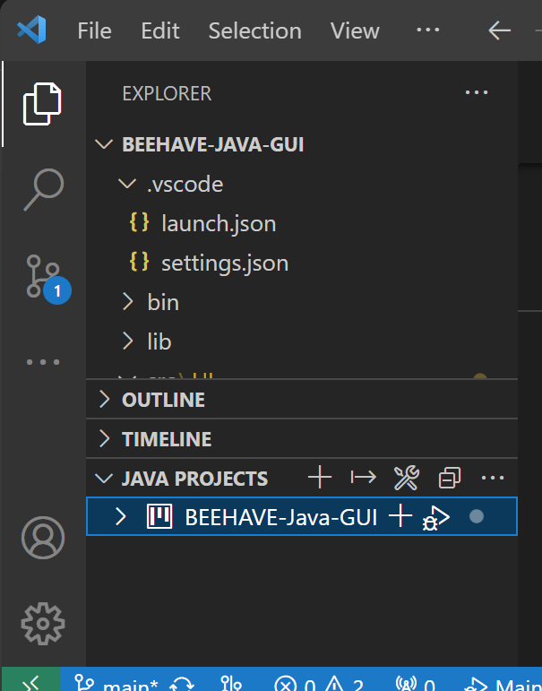

# Setup
Diese Software funktioniert am Besten mit [`VSCode`](https://code.visualstudio.com/Download).
Es ist wichtig, dass das [`Extension Pack of Java`](https://marketplace.visualstudio.com/items?itemName=vscjava.vscode-java-pack).

## Nötige Entwicklungsabhängigkeiten
[`Netlogo`](https://ccl.northwestern.edu/netlogo/download.shtml) == `6.2.2`

[`JavaFx SDK`](https://openjfx.io/) >= `20.0.1` 

## Projekt und Abhängigkeiten in VSCode aufsetzen um die Software zu kompilieren, debuggen und auszuführen 
Im `.vscode/` Ordner gibt es 2 Dateien `settings.json` und `launch.json`.
Die Pfade dort müssen angepasst werden.

Dafür kann den Schritten in [`JavaFx`'s official documentation](https://openjfx.io/openjfx-docs/#IDE-VSCode) unter Abschnitt 4 **Create and update launch configurations** gefolgt werden.
Nun fehlt nur noch das Hinzufügen des Pfades von `Netlogo` (`Netlogo6.2.2/app/netlogo.jar`) zu der `settings.json` genauso wie bei `JavaFx`.

# Troubleshooting
Fehler `UI.Main not found` vom `VSCode`'s _Run & Debug_ menu, wenn die Applikation gestartet wird:
Eventuell muss die `Main` Klasse zu `VSCode`'s _Java Projects_ (Im Abschnitt _Explorer_, wenn eine `.java` Datei geöffnet wurde) erneut hinzugefügt werden. 

Die ``Main.java` muss unter `File`s und/oder `Folder`s neben dem `+` neben `BEEHAVE-Java-GUI` hinzugefügt werden.

------------------------
# Known issues
### Breaking issues
- ``Time Comparison Chart``: Nach einem Refresh werden manchmal keine Graphen mehr angezeigt. 
- In den **Kalenderfeldern** können auch unpassende Daten eingegeben werden (Wörter oder Zahlen nicht im Datumsformat). Dies sorgt dann dafür dass das BEEHAVE-Modell nicht ordnungsgemäß funktioniert.
### Non-breaking issues
- Bei `Initial Bees`können auch Kommazahlen (`double`) eigegeben werden. Die Simulation wird dadurch nicht beinträchtigt. 
- Mehrere `Settings` dürfen mit identischem Namen abgespeichert werden. Die Einstellungen werden nicht überschrieben, sondern sind nur nicht auseinanderhaltbar.

